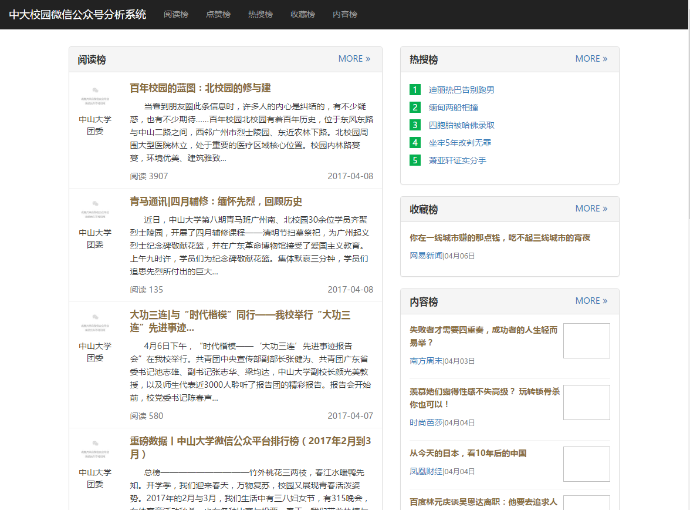
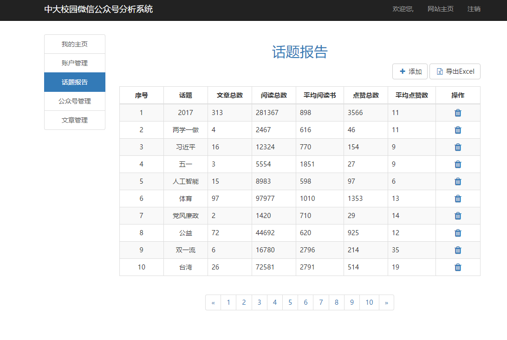

#### [demo](http://120.77.16.144:9998/WeChatMining/app#/front/index)
### ==Attention==
> 因为是练手的，没啥实际用途，水平不高，没有cdn，没压缩，没lazyloading等，bug多，加载慢，很脆弱，请善待demo，拜托拜托！

####  指定公众号分析系统
1. 后台：java 
2. 前台：angularjs、bootstrap、jquery....
3. 工具：gulp、bower

####  目录
1. server 不是真后台，只是测试数据
2. client 编程文件
3. dest 目标生成文件

#### 效果图

#### [API Document](./docs/api.md)

#### 前端文件位置
1. 前端目标文件都在dest目录下

#### 前端展示步骤
1. 安装nodejs
2. [下载代码](https://github.com/zongyang/wechat-gongzhonghao-analysis)
3. 切换到项目目录下
4. 运行 npm install --production，下载后台所需的包
5. 运行 npm install bower
6. 运行 bower install，下载前台所需的包
7. 运行 node app.js，启动服务
8. 前台页面地址: http://127.0.0.1:8080/#/front/index (未定义路径都将跳到此页面)
9. 后台页面地址: http://127.0.0.1:8080/#/admin/index
10. 后台登录：http://127.0.0.1:8080/login

